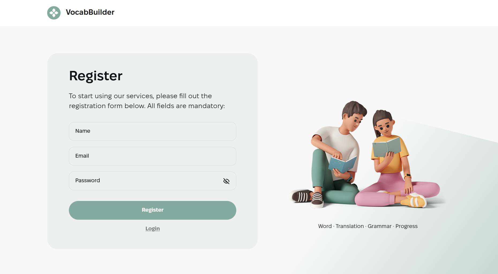
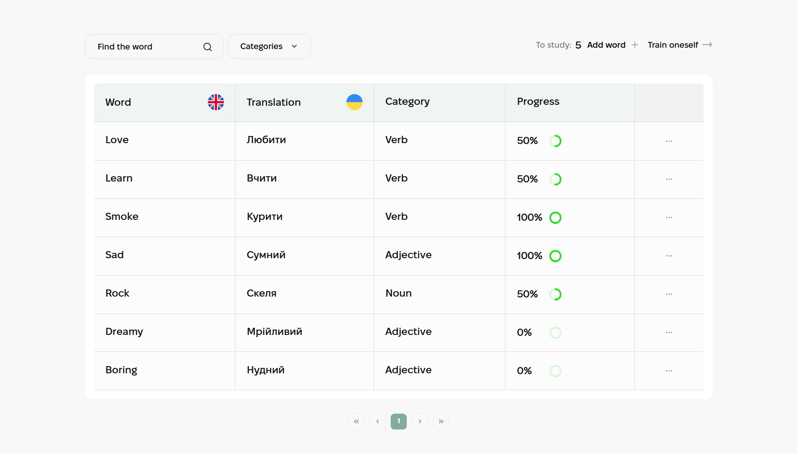
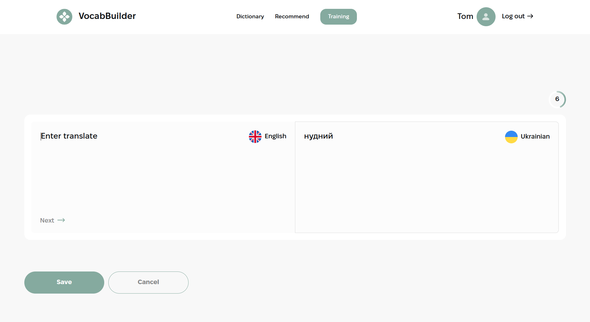

# VocabBuilder 

VocabBuilder is an interactive web-based English language learning application that allows users to learn new words, practice, and keep track of personal progress. The application includes an authorization system, tools for filtering, searching for words, as well as the ability to add and view personal and recommended words.


## Features

- User Authentication: Register and login functionality allowing users to access personal and secure content.

- Dashboard: Central hub for accessing various features like word management, training, and statistics.

- Word Management: Add, edit, and delete words from the user's personal dictionary. Features a modal for adding new words.

- Training Mode: Interactive training sessions with tasks for translating words from English to Ukrainian and vice versa.

- Progress Tracking: Visual progress indicators showing the user's learning progress through a customizable progress bar.

- Word Filtering: Dynamic word filtering in the dictionary and recommendations page, based on category or search terms.

- Word Recommendations: Explore words added by other users and add them to your dictionary directly from the recommendations page.

- Responsive Design: The layout adapts seamlessly across different devices:
  - Mobile: From 320px (fluid) and becomes adaptive from 375px.
  - Tablet: Starts from 768px.
  - Desktop: From 1440px onwards.

## Tech Stack

- React
- Redux
- React Router
- React Hook Form
- Yup
- Axios
- MUI (Material-UI)
- React Toastify
- lodash.debounce
- nanoid
- React Table
- Redux Persist

## Routes

- `/register` - the registration page allows new users to create an account in VocabBuilder. After registration, users can use their account to manage their vocabulary.



- `/login` - on the login page, existing users can log into their account using their email and password. Successful login grants access to all other pages of the app.

- `/dictionary` - the dictionary page features a panel that helps authorized users manage their learning, filter words, and add new words. It includes a table showing all words added by the user, with columns for the English and Ukrainian versions of the word, category, and learning progress.



- `/recommend` - a page that helps authorized users find new words added by other users and add them to their own vocabulary. The filter assists in finding words through a text input field or by filtering by category.

- `/training` - a training page featuring a progressBar - a visual representation of the user's progress in training, and a training room: a two-section block displaying the task word and a field for entering the response.



## Resource

- Design Mockups: [View Design Mockups](https://www.figma.com/file/XRhVBdCX1wPyzCRA567kud/VocabBuilder?type=design&node-id=0-1&mode=design&t=Aa7GiCvVIpx6Nvi5-0)
- Technical Requirements: [View Technical Requirements](https://docs.google.com/spreadsheets/d/15zCxbWA7ubDmFzjmzzXe6ysiHVMd4iD2PcZ7ilN2gRc/edit?gid=1060862504#gid=1060862504)
- [Backend](https://vocab-builder-backend.p.goit.global/api-docs/)

## Installation

To run this project locally, follow these steps:

1. Clone the repository:

```bash
  git clone https://github.com/ValentinaHotsa/vocab-builder
```

2. Install the dependencies:

```
npm install
```

3. Start the development server:

```
npm start
```

## Author

For more information or if you have any questions, feel free to contact me:

- GitHub [ValentinaHotsa](https://github.com/ValentinaHotsa)
- LinkedIn [Valentyna Hotsa](https://www.linkedin.com/in/valentynahotsa/)

# UA 

VocabBuilder - це інтерактивний веб-додаток для вивчення англійської мови, який дозволяє користувачам вивчати нові слова, тренуватись, а також тримати статистику особистого прогресу. Додаток включає в себе систему авторизації, інструменти для фільтрації, пошуку слів, а також можливості для додавання та перегляду персональних та рекомендованих слів.


## Особливості

- Автентифікація користувачів: дозволяє користувачам реєструватися та входити в систему, надаючи доступ до персоналізованих функцій та налаштувань.

- Панель керування: центральний інтерфейс для керування навчанням користувачів, перегляду статистики та доступу до різних функціональних можливостей.

- Управління словами: користувачі можуть додавати, редагувати та видаляти слова у своєму особистому словнику. Є модальне вікно для додавання нових слів.

- Тренування: кімната тренувань, де користувачі можуть практикувати переклад слів між англійською та українською мовами, покращуючи свій словниковий запас.

- Відстеження прогресу: Містить візуальне представлення прогресу користувача у вивченні нових слів через динамічну смугу прогресу.

- Фільтрація слів: дозволяє користувачам фільтрувати слова у своєму словнику або рекомендаціях за категоріями або пошуковими запитами.

- Рекомендації слів: дає можливість користувачам відкривати нові слова, додані іншими, та включати їх у свій навчальний шлях.

- Адаптивний дизайн: верстка адаптивна:
  - mobile: (від 320рх - гумова; від 375px - адаптивна)
  - tablet: від 768px;
  - desktop: від 1440px

## Маршрути

- `/register` - сторінка реєстрації дозволяє новим користувачам створювати обліковий запис у VocabBuilder. Після реєстрації користувачі можуть використовувати обліковий запис для управління своїм словником.


- `/login` - на сторінці входу існуючі користувачі можуть увійти в обліковий запис, використовуючи свій e-mail та пароль. Успішний вхід надає доступ до всіх інших сторінок додатку.

- `/dictionary` - сторінка словника, на якій є панель, яка допомогає авторизованому користувачу здійснювати контроль над вивченням ним слів, фільтрувати слова та додавати нові слова і таблиця, що показує всі слова, додані користувачем. Вона включає колонки для англійської та української версії слова, категорії, та прогресу вивчення.


- `/recommend` - сторінка яка допомогає авторизованому користувачу знаходити нові для нього слова, додані іншими користувачами та додавати до свого словника. В пошуку допомагає фільтр, за допомогою якого можна знайти слова через поле для вводу чи відфільтрувати по категоріям.

- `/training` - сторінка для тренувань, на якій є progressBar - візуальне відображення прогресу користувача у тренуванні та trainingRoom: двосекційний блок з відображенням слова-завдання та поля для введення відповіді.


## Ресурси

- Макет: [Переглянути макет](https://www.figma.com/file/XRhVBdCX1wPyzCRA567kud/VocabBuilder?type=design&node-id=0-1&mode=design&t=Aa7GiCvVIpx6Nvi5-0)
- Технічне завдання: [Переглянути технічне завдання](https://docs.google.com/spreadsheets/d/15zCxbWA7ubDmFzjmzzXe6ysiHVMd4iD2PcZ7ilN2gRc/edit?gid=1060862504#gid=1060862504)
- [Backend до проєкту](https://vocab-builder-backend.p.goit.global/api-docs/)

## Встановлення

Щоб запустити цей проект локально, виконайте такі дії:

1. Клонуйте репозиторій:

```bash
  git clone https://github.com/ValentinaHotsa/vocab-builder
```

2. Встановіть залежності:

```
npm install
```

3. Запустіть сервер розробки:

```
npm start
```

## Автор

Щоб отримати додаткову інформацію або у вас виникли запитання, зв'яжіться зі мною:

- GitHub [ValentinaHotsa](https://github.com/ValentinaHotsa)
- LinkedIn [Valentyna Hotsa](https://www.linkedin.com/in/valentynahotsa/)
